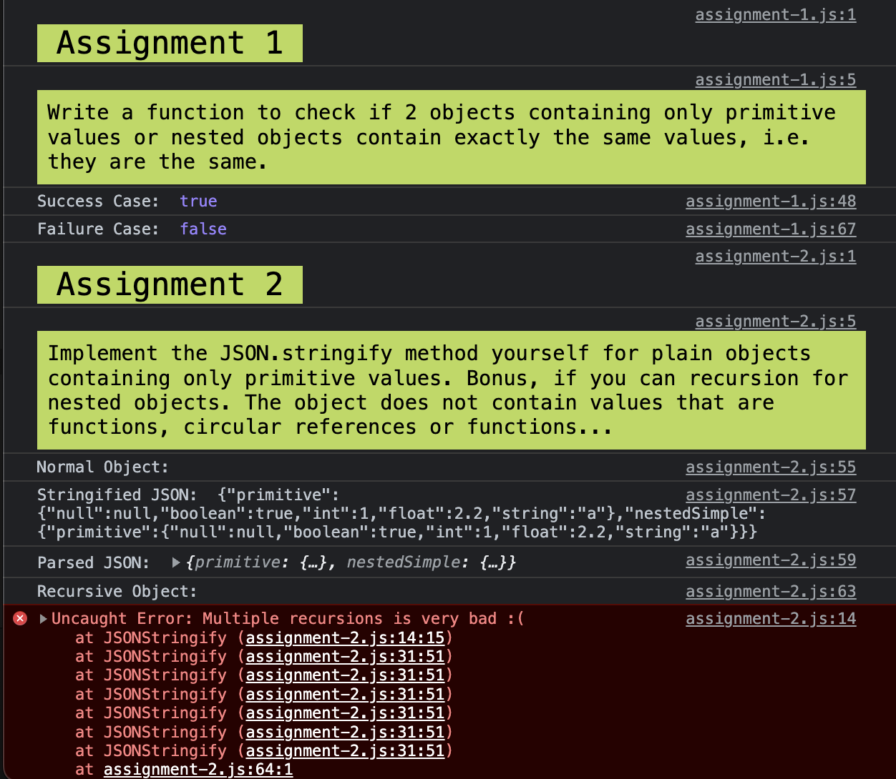

# JavaScript Assignment

# Requirement
- Write a function to check if 2 objects containing only primitive values or nested objects contain exactly the
same values, i.e. they are the same.
- Implement the JSON.stringify method yourself for plain objects containing only primitive values. Bonus, if you
can recursion for nested objects. The object does not contain values that are functions, circular references or
functions...

# Output
