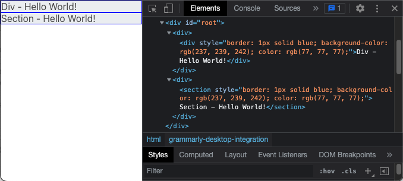

# React Dynamic Elements Assignment

# Requirement
## Dynamically render the components
```
const pageElements = [
    {
        /**
        * This can be div/section or any block level element.
        */
        htmlElementName: "div",
        innerHTML: "Div - Hello World!",
        /**
        * The keys are what we set for HTMLElement.style[key]
        * eg: document.getElementById('myDiv').style.color = 'red'
        */
        style: {
            border: "1px solid blue",
            backgroundColor: "#edeff2",
            color: "#4d4d4d",
        },
    },
    {
        /**
        * This can be div/section or any block level element.
        */
        htmlElementName: "section",
        innerHTML: "Section - Hello World!",
        /**
        * The keys are what we set for HTMLElement.style[key]
        * eg: document.getElementById('myDiv').style.color = 'red'
        */
        style: {
            border: "1px solid blue",
            backgroundColor: "#edeff2",
            color: "#4d4d4d",
        },
    },
];
```

# Output
